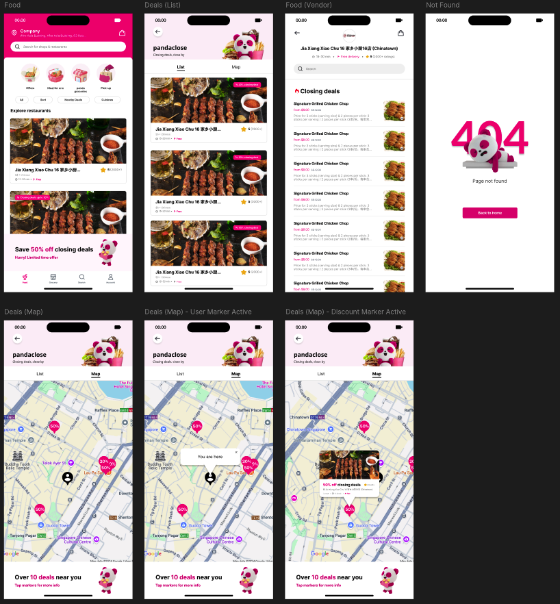
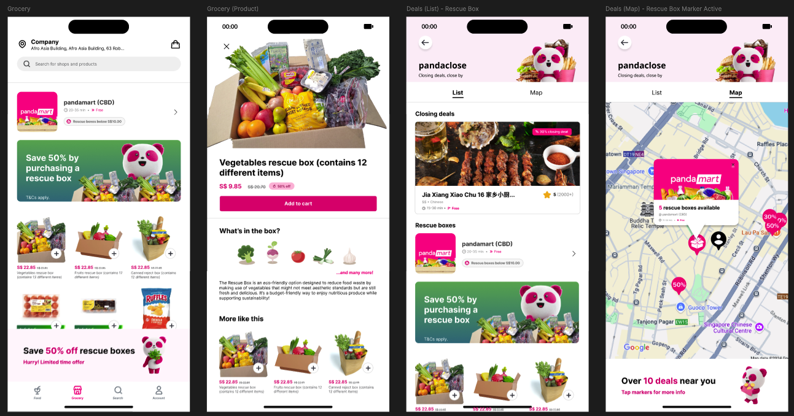

# pandaclose - foodpanda Hackathon (Frontend)

## Overview
pandaclose is a sustainability-driven feature for a food delivery app that helps reduce food waste. It allows vendors to list closing deals on dishes nearing expiration. Consumers can explore these deals through a dedicated page or a map view, helping them decide whether to pick up orders or have them delivered. 

<p align="center">
  
</p>

This repository contains the frontend implementation of the consumer experience built with React for our hackathon project focused on **sustainability and waste reduction**.


* [Frontend Repository](https://github.com/averygan/bon-appetea-frontend) (React, Tailwind CSS)
* [Backend Repository](https://github.com/averygan/bon-appetea-backend) (Golang, MySQL, Docker Compose, Colima)

## Table of Contents
1. [UI/UX](#uiux)
2. [Features](#features)
3. [Technologies Used](#technologies-used)
4. [Installation and Setup](#installation--setup)
5. [Usage](#usage)
6. [Folder Structure](#folder-structure)

## UI/UX

### User Stories
- **As a vendor**, I want to offer discounts on specific dishes near closing or after lunch hours, so that I can reduce food waste and increase sales during off-peak periods.
- **As a customer**, I want to discover closing discounts nearby, so that I can enjoy affordable meals while helping reduce food waste.


### Wireframes
Below are the wireframes for both the current and future (possible) implementation. The links to the Figma project can be accessed
- [Figma design](https://www.figma.com/design/5o3xq5qUgmnXGrGgq28ofL/pandaclose?node-id=422-3494&t=1iWv07DY0Z1ADjiZ-1) 
- [Figma prototype](https://www.figma.com/proto/5o3xq5qUgmnXGrGgq28ofL/pandaclose?node-id=422-3494&t=1iWv07DY0Z1ADjiZ-1)

**Current Implementation**


**Next Steps**



## Features
- **Closing Deals Exploration**: Browse vendor-listed closing deals on specific dishes
- **Map View Integration**: View nearby closing deals on an interactive map for easier decision-making
- **Vendor Pages**: Explore vendor-specific offers and menus
- **Search & Filter Options**: Search for specific vendors or filter based on preferences
- **Responsive Design**: Optimized for mobile with a clean, user-friendly interface


## Technologies Used
### Frontend
* [React](https://react.dev/) - JavaScript library for building user interfaces
* [Tailwind](https://tailwindcss.com/) - Utility-first CSS framework for styling

### Backend
* [Golang](https://go.dev/) - Backend server programming language
* [MySQL](https://www.mysql.com/) - Relational database for storing application data
* [Docker Compose](https://docs.docker.com/compose/) - Tool for defining and running multi-container Docker applications
* [Colima](https://github.com/abiosoft/colima) - Local development environment for containerized applications

## Installation & Setup
To run the frontend locally, follow these steps:

1. **Clone the Repository**  
   ```bash
   git clone https://github.com/averygan/bon-appetea-frontend.git pandaclose-frontend
   cd pandaclose-frontend

2. **Set Up Environment Variables**

    Duplicate the provided `.env.sample` file, rename it to `.env` and fill in the following environment variables in the .env file
    ```mathematica
    # Default address
    VITE_DEFAULT_LATITUDE=<Your Default Location Latitude>
    VITE_DEFAULT_LONGITUDE=<Your Default Location Longitude>
    VITE_DEFAULT_NAME=<Your Default Location Name>
    VITE_DEFAULT_BLOCK=<Your Default Location Block No>
    VITE_DEFAULT_ROAD=<Your Default Location Road Name>
    VITE_DEFAULT_POSTALCODE=<Your Default Location Postal Code>

    # Leaflet access token
    VITE_LEAFLET_ACCESS_TOKEN=<Your Leaflet Access Token>

    # Backend URL
    VITE_DEFAULT_API_URL=http://<Host>:<Port Number>
    ```

3. **Install Dependencies**
Ensure you have `Node.js` and `npm` installed, then run
    ```bash
    npm install
    ```

4. **Start the Development Server**
    ```bash
    npm run dev
    ```

5. **Access the Application**

    Open http://localhost:5173 (default Vite port) in your browser to access the app

## Usage

### Navigating the Application
- **Deals Page**  
  Navigate to the main Deals Page to browse all vendor-listed closing deals, including discounts on specific dishes near closing or post-lunch hours.

- **Map View**  
  Switch to the Map View to explore closing deals near your current location. This helps you decide whether to:  
   - **Pick Up** the food directly from the vendor.  
   - **Request Delivery** using riders.

- **Vendor Pages**  
  Access individual vendor pages to view specific dishes, offers, and menus. Use the **search bar** to find dishes or vendors quickly.

<div style="display: flex; justify-content: space-evenly; align-items: center;" align="center">
  
  
</div>

### Key Features
1. **Filter & Search**: Easily search for vendors or dishes.  
2. **Map Integration**: Visualize nearby deals with Leaflet-powered interactive maps.  
3. **Limited-Time Offers**: Grab discounts before they expire.  

## Folder Structure
The project structure follows a modular and scalable React architecture:

```markdown
bon-appetea-frontend
│── assets/ # Static assets 
│ ├── images/ # Image files 
│ └── readme/ # README assets (if any) 
│── public/ # Public directory for static files 
│── src/ # Application source code 
│ ├── components/ # Reusable UI components 
│ ├── contexts/ # Context providers for state management 
│ ├── utils/ # Utility functions and helpers 
│ └── views/ # Page views (main application pages) 
│── App.css # Global CSS 
│── App.jsx # Root React component 
│── main.jsx # Application entry point 
│── .env # Local environment variables 
│── .env.sample # Environment variable template 
│── .gitignore # Git ignore file 
│── eslint.config.js # ESLint configuration 
│── index.html # Main HTML file 
│── package-lock.json # Lockfile for dependencies 
│── package.json # Project dependencies and scripts 
│── postcss.config.js # PostCSS configuration 
│── README.md # Project documentation 
│── tailwind.config.js # Tailwind CSS configuration 
└── vite.config.js # Vite configuration file
```
